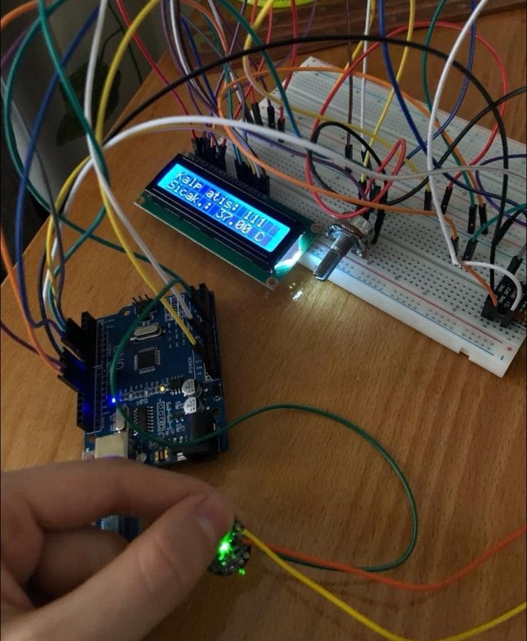

# 🏥 IoT Patient Health Monitoring System

A real-time patient health monitoring system built with ESP32, featuring body temperature and heart rate tracking displayed on an LCD screen and visualized on ThingSpeak over the internet.

---

## 📡 About the Project

This IoT-based system continuously monitors a patient's vital signs — body temperature and heart rate — using an ESP32 microcontroller. The data is displayed locally on a 16x2 LCD screen and sent to the ThingSpeak cloud platform every 15 seconds, where it can be viewed as live graphs from anywhere in the world.

---

## ✨ Features

- ❤️ Real-time heart rate measurement (BPM)
- 🌡️ Body temperature measurement via LM35 sensor
- 💡 LED blinks with every heartbeat
- 🖥️ Live data displayed on 16x2 LCD screen
- 📊 Data sent to ThingSpeak for remote monitoring and graphing
- 📶 WiFi connectivity via ESP32

---

## 🛠️ Hardware Components

| Component | Description |
|-----------|-------------|
| ESP32 | Microcontroller with built-in WiFi |
| LM35 | Analog temperature sensor (10mV/°C) |
| Pulse Sensor | Heart rate sensor (green, fingertip) |
| LCD 16x2 | Display for local readings |
| Potentiometer | LCD brightness adjustment |
| LED | Blinks on each heartbeat |
| Breadboard + Jumper Wires | Circuit connections |

---

## 🔌 Pin Connections

| Component | ESP32 Pin |
|-----------|-----------|
| LM35 | GPIO 34 |
| Pulse Sensor | GPIO 35 |
| LED | GPIO 2 |
| LCD RS | GPIO 19 |
| LCD EN | GPIO 23 |
| LCD D4 | GPIO 18 |
| LCD D5 | GPIO 17 |
| LCD D6 | GPIO 16 |
| LCD D7 | GPIO 15 |

---

## 📦 Required Libraries

Install via Arduino IDE Library Manager:

- `PulseSensorPlayground`
- `ThingSpeak`
- `LiquidCrystal` (built-in)
- `WiFi` (built-in for ESP32)

---

## ⚙️ Setup

### 1. ThingSpeak Configuration
1. Create a free account at [thingspeak.com](https://thingspeak.com)
2. Create a new channel with:
   - Field 1: `BPM`
   - Field 2: `Temperature`
3. Copy your **Channel ID** and **Write API Key**

### 2. Update the Code

Open the `.ino` file and fill in your credentials:

```cpp
const char* ssid     = "YOUR_WIFI_NAME";
const char* password = "YOUR_WIFI_PASSWORD";

unsigned long channelID   = YOUR_CHANNEL_ID;
const char*   writeAPIKey = "YOUR_WRITE_API_KEY";
```

### 3. Upload

- Select **ESP32** as your board in Arduino IDE
- Upload the code
- Open Serial Monitor (115200 baud) to see the IP address and sensor readings

---

## 📊 How It Works

1. ESP32 reads heart rate from the Pulse Sensor every loop cycle
2. ESP32 reads body temperature from LM35 (averaged over 10 readings for stability)
3. Data is shown on the LCD screen in real time
4. LED blinks with each detected heartbeat
5. Every 15 seconds, BPM and temperature are sent to ThingSpeak
6. ThingSpeak displays live graphs accessible from any browser

---

## 🖥️ ThingSpeak Dashboard

After uploading, open your ThingSpeak channel to see live graphs:

```
Field 1 → Heart Rate (BPM)
Field 2 → Body Temperature (°C)
```

---

## 👩‍💻 Developer

**Öznur Yakut**  
[](https://github.com/oznuryakut)

---

> This project was developed as part of the **Internet of Things (IoT)** course. © 2024 Öznur Yakut
